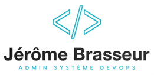
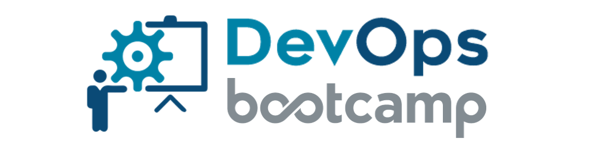

<!--
*** Merci d'avoir consulté le modèle Best-README. Si vous avez une suggestion
*** qui pourrait l'améliorer, merci de forker le repo et de créer une pull request
*** ou simplement ouvrir un problème avec le tag "enhancement".
*** Merci encore ! :D
-->

<!-- Readme principal du projet -->
<!--
*** J'utilise des liens markdown "style référence" pour plus de lisibilité.
*** Les liens de référence sont mis entre crochets [ ] au lieu de parenthèses ( ).
*** Voir le bas de ce document pour la déclaration des variables de référence.
*** pour contributeurs-url, forks-url, etc. Voici une syntaxe optionnelle et concise que vous pouvez utiliser.
*** https://www.markdownguide.org/basic-syntax/#reference-style-links
-->

# 

## Auteur

👤**Jérôme BRASSEUR**

* Github: [@Jérôme Brasseur](https://github.com/jeromebrasseur)
* LinkedIn: [@Jérôme Brasseur](https://www.linkedin.com/in/jeromebrasseur92000)

***

### 📎 Bootcamp25 - admin système DevOps 

_`Début du projet le 01/05/2025`_

***

<!-- TABLE DES MATIÈRES -->

  
<h2 style="display: inline-block">Table des matières</h2>

  <ol>
    <li><a href="#a-propos-du-bootcamp">A propos du bootcamp</a></li>
    <li><a href="#les-outils-devops">Les outils DevOps</a></li>
    <li><a href="#utilisé-dans-les-projets">Utilisé dans les projets</a></li>
    <li><a href="#remerciements">Remerciements</a></li>
  </ol>

 

<!-- A PROPOS DU BOOTCAMP -->
## A propos du bootcamp

Le bootcamp DevOps est organisé par [Eazytraining](https://eazytraining.fr).

Les objectifs sont les suivants :

* Comprendre la culture DevOps et comment cette pratique prend de l’ampleur dans l’univers de l’informatique
* Répondre aux nombreux besoins des entreprises sur les thèmes de développement continue et intégration continue
* Être capable de proposer une chaîne complète CI/CD et de la monter entièrement
* Sécuriser une infrastructure DevOps à l’ère du Cloud

 

<!-- LES OUTILS DEVOPS -->
## Les outils DevOps

Durant les 3 mois de formation, des cours théoriques et des ateliers pratiques permettent aux apprenants de développer leurs compétences sur les outils suivants :

* [![Docker][Docker.com]][Docker-url]
* [![Gitlab][Gitlab.com]][Gitlab-url]
* [![Jenkins][Jenkins.io]][Jenkins-url]
* [![Terraform][Terraform.com]][Terraform-url]
* [![Ansible][Ansible.com]][Ansible-url]
* [![Kubernetes][Kubernetes.io]][Kubernetes-url]

 

<!-- EXEMPLES D'UTILISATION -->
## Utilisé dans les projets

Cette section liste les principaux systèmes et applications utilisés dans les différents projets.

| Systèmes   | Base de données   | Langages   | Editeur de code   | Virtualisation  | Cloud         | Travail collaboratif  |
| :--------: |:--------------:   |:---------: |:---------------:  |:-------------:  |:----------:   |:------------------:   |
| [![Ubuntu][Ubuntu.com]][Ubuntu-url] | [![MariaDB][MariaDB.org]][MariaDB-url] | [![Bash][Bash.com]][Bash-url] | [![Vim][Vim.org]][Vim-url] | [![Vagrant][Vagrant.com]][Vagrant-url] | [![Aws][Aws.com]][Aws-url] | [![Github][Github.com]][Github-url] |
| [![Debian][Debian.org]][Debian-url] | [![MySQL][MySQL.com]][MySQL-url] | [![Python][Python.org]][Python-url] | [![VScode][VScode.com]][VScode-url] | [![Virtualbox][Virtualbox.org]][Virtualbox-url] | [![Hostinger][Hostinger.com]][Hostinger-url] | [![Slack][Slack.com]][Slack-url] |
| [![Windows][Windows.com]][Windows-url] |                                     | [![Yaml][Yaml.org]][Yaml-url]       |           |          |          |

 

<!--Remerciements -->
## Remerciements

* [Eazytraining](https://eazytraining.fr)
* [Dirane TAFEN](https://github.com/diranetafen)
* [Olivier GOUOKAM](https://github.com/olivierkouokam)
* [Aurélie KAMGANG](https://github.com/aurelie-kamgang)

 

**[⬆ Retour en haut](#auteur)**  

<!-- MARKDOWN LINKS & IMAGES -->
<!-- https://www.markdownguide.org/basic-syntax/#reference-style-links -->
[Docker.com]: https://img.shields.io/badge/Docker-2496ED?logo=docker&logoColor=fff
[Docker-url]: https://docker.com/
[Gitlab.com]: https://img.shields.io/badge/GitLab%20CI-FC6D26?logo=gitlab&logoColor=fff
[Gitlab-url]: https://gitlab.com/
[Jenkins.io]: https://img.shields.io/badge/Jenkins-D24939?logo=jenkins&logoColor=white
[Jenkins-url]: https://jenkins.io/
[Kubernetes.io]: https://img.shields.io/badge/Kubernetes-326CE5?logo=kubernetes&logoColor=fff
[Kubernetes-url]: https://kubernetes.io/
[Ansible.com]: https://img.shields.io/badge/Ansible-000?logo=ansible&logoColor=fff
[Ansible-url]: https://svelte.dev/
[Terraform.com]: https://img.shields.io/badge/Terraform-734F96?logo=terraform&logoColor=fff
[Terraform-url]: https://developer.hashicorp.com/terraform
[Ubuntu.com]: https://img.shields.io/badge/Ubuntu-E95420?logo=ubuntu&logoColor=white
[Ubuntu-url]: https://ubuntu.com
[Debian.org]: https://img.shields.io/badge/Debian-A81D33?logo=debian&logoColor=fff
[Debian-url]: https://debian.org
[Windows.com]: https://custom-icon-badges.demolab.com/badge/Windows-0078D6?logo=windows11&logoColor=white
[Windows-url]: https://windows.com
[Aws.com]: https://img.shields.io/badge/AWS-%23FF9900.svg?logo=amazon-web-services&logoColor=white
[Aws-url]: https://aws.amazon.com
[Hostinger.com]: https://img.shields.io/badge/Hostinger-673DE6?logo=hostinger&logoColor=fff
[Hostinger-url]: https://hostinger.com
[Vim.org]: https://img.shields.io/badge/Vim-%2311AB00.svg?logo=vim&logoColor=white
[Vim-url]: https://vim.org
[VScode.com]: https://custom-icon-badges.demolab.com/badge/Visual%20Studio%20Code-0078d7.svg?logo=vsc&logoColor=white
[VScode-url]: https://code.visualstudio.com
[MariaDB.org]: https://img.shields.io/badge/MariaDB-003545?logo=mariadb&logoColor=white
[MariaDB-url]: https://mariadb.org
[MySQL.com]: https://img.shields.io/badge/MySQL-4479A1?logo=mysql&logoColor=fff
[MySQL-url]: https://mysql.com
[Bash.com]: https://img.shields.io/badge/Bash-4EAA25?logo=gnubash&logoColor=fff
[Bash-url]: https://fr.wikipedia.org/wiki/Bourne-Again_shell
[Python.org]: https://img.shields.io/badge/Python-3776AB?logo=python&logoColor=fff
[Python-url]: https://python.org
[Yaml.org]: https://img.shields.io/badge/YAML-CB171E?logo=yaml&logoColor=fff
[Yaml-url]: https://yaml.org
[Github.com]: https://img.shields.io/badge/GitHub-%23121011.svg?logo=github&logoColor=white
[Github-url]: https://github.com
[Slack.com]: https://img.shields.io/badge/Slack-4A154B?logo=slack&logoColor=fff
[Slack-url]: https://app.slack.com
[Vagrant.com]: https://img.shields.io/badge/Vagrant-3668FF?logo=vagrant&logoColor=fff
[Vagrant-url]: https://developer.hashicorp.com/vagrant
[Virtualbox.org]: https://img.shields.io/badge/VirtualBox-FE7A16?logo=virtualbox&logoColor=fff
[Virtualbox-url]: https://virtualbox.org
